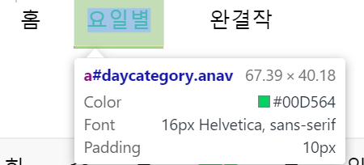

# Cappit study project week2 assignments


## 1. DOM의 이해     

#### 1-1. DOM datatypes    
   - document : object  
   
   
     
   - element : object  
     
   
   - nodeList :  the object(array) that having objects(nodes)  
     
   
   - attribute : object  
     
     
   기본적으로 DOM의 이름에 걸맞게 객체로 구성되어있음을 알 수 있다.  
     
     
--------------------     
             
 
#### 1-2. 1주차 과제물 DOM 분석  
   - document.body:  
     
   document의 html태그들이 객체형식으로 담겨있는 것을 알 수 있습니다.  
   
   - document.getElementById(id) :  
     
   
     
   1주차 html에서 fri라는 id 값을 갖고있는 태그를 객체형식으로 가져올 수 있습니다.  
   
   - document.getElementsByTagName(name) :  
     
   header라는 태그를 갖고있는 element를 배열(객체)로 가져올 수 있습니다.  
     
     
     
   - document.createElement(name) :  
     
   element 객체를 만들 수 있습니다. <p></p> 태그 객체를 만들었습니다.  
   
   - parentNode.appendChild(node) :  
     
   홈태그를 확인하고, 첫번째 객체인자를 가져옵니다(참조).  
     
      1. homeNode를 class이름 "anav"를 통해 참조
      2. div 태그 생성
      3. homeNode가 참조하는 객체에 div라는 document object를 child로 붙입니다.  
      
   - element.innerHTML :  
     
   console.log로 찍어보니 anav를 통해 가져온 document객체안의 내용을 아까 붙였던 child와 함께 보여줍니다.  
   
   - element.style.left :  
   element의 style에 left값을 변경(생성) 합니다.  
   
   - element.setAttribute :  
     
   anav라는 클래스명을 갖고있는 태그를,  
     
   title로 바꾸어줍니다.
     
   클래스명이 title로 바뀌었습니다.  
   
   - element.getAttribute :  
     
   element의 attribute를 가져옵니다.  
   
   - element.addEventListener :  
   element에 이벤트리스너를 붙입니다.
   ```
   const onClickListner = () =>{
      let dummy = document.getElementsByTagName("div")[0] //DOM에서 div태그의 맨처음 객체를 가져옵니다.
      dummy.InnerHtml = "hi";
    }
   homeNode.addEventListner("click",onClickListner);
   ```
   homeNode 객체에 클릭을 했을때 발생하는 이벤트를 넣습니다.  
   
   - window.content :  
   
   - window.onload :  
   
   - window.dump :  
   
   - window.scrollTo :  
   브라우저가 현재 나타내고있는 html의 스크롤 위치(_(x,y) 좌표_)를 움직여 줄 수 있습니다.  
   
   - window.location :  
     
   현재 브라우저의 위치를 나타냅니다.
   
   
   ----------------
   
## 2.JavaScript

#### 2-1. JS코드를 활용한 type, command 이해
--------------------
#### 2-2. 다양한 환경에서 실행
  1. HTML Script
  2. NodeJs
  3. Chrome developer tool

------------------
## 3. acmicpc
  - 1065
  - 11729
  - 2851
  - 11726
  - 10825  
  
  
  
  
----------------
## 4. JQeury 를 활용한 1주차 과제 DOM 분석
