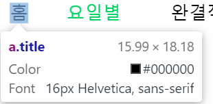

# Cappit study project week2 assignments


## 1. DOM의 이해     

#### 1-1. DOM datatypes    
   - document : object  
   
   
     
   - element : object  
     
   
   - nodeList :  the object(array) that having objects(nodes)  
     
   
   - attribute : object  
     
     
   기본적으로 DOM의 이름에 걸맞게 객체로 구성되어있음을 알 수 있다.  
     
     
--------------------     
             
 
#### 1-2. 1주차 과제물 DOM 분석  
   - document.body:  
     
   document의 html태그들이 객체형식으로 담겨있는 것을 알 수 있습니다.  
   
   - document.getElementById(id) :  
     
   
     
   1주차 html에서 fri라는 id 값을 갖고있는 태그를 객체형식으로 가져올 수 있습니다.  
   
   - document.getElementsByTagName(name) :  
     
   header라는 태그를 갖고있는 element를 배열(객체)로 가져올 수 있습니다.  
     
     
     
   - document.createElement(name) :  
     
   element 객체를 만들 수 있습니다. <p></p> 태그 객체를 만들었습니다.  
   
   - parentNode.appendChild(node) :  
     
   홈태그를 확인하고, 첫번째 객체인자를 가져옵니다(참조).  
     
      1. homeNode를 class이름 "anav"를 통해 참조
      2. div 태그 생성
      3. homeNode가 참조하는 객체에 div라는 document object를 child로 붙입니다.  
      
   - element.innerHTML :  
     
   console.log로 찍어보니 anav를 통해 가져온 document객체안의 내용을 아까 붙였던 child와 함께 보여줍니다.  
   
   - element.style.left :  
   element의 style에 left값을 변경(생성) 합니다.  
   
   - element.setAttribute :  
     
   anav라는 클래스명을 갖고있는 태그를,  
     
   title로 바꾸어줍니다.
     
   클래스명이 title로 바뀌었습니다.  
   
   - element.getAttribute :  
     
   element의 attribute를 가져옵니다.  
   
   - element.addEventListener :  
   element에 이벤트리스너를 붙입니다.
   ```
   const onClickListner = () =>{
      let dummy = document.getElementsByTagName("div")[0] //DOM에서 div태그의 맨처음 객체를 가져옵니다.
      dummy.InnerHtml = "hi";
    }
   homeNode.addEventListner("click",onClickListner);
   ```
   homeNode 객체에 클릭을 했을때 발생하는 이벤트를 넣습니다.  
   
   - window.content :  
   
   - window.onload :  
   브라우저가 dom객체를 처리하고 화면에 표시된 뒤 실행됩니다.  
   보통 html, css , js파일등을 다 브라우저가 처리한 뒤 함수를 실행하고 싶을 때 많이 사용합니다.  
   확실하게 script를 실행하고 싶을 때, 모든 javascript 함수를 **window= function(){ ///all code///}** 이렇게 실행합니다.
   - window.dump :  
   ```
   window.dump(message)
   ```
   message를 console에 출력합니다.
   브라우저가 dump를 지원해주면 javascript를 디버깅을 할 때 사용됩니다.
   
   - window.scrollTo :  
   브라우저가 현재 나타내고있는 html의 스크롤 위치(_(x,y) 좌표_)를 움직여 줄 수 있습니다.  
   
   - window.location :  
     
   현재 브라우저의 위치를 나타냅니다.
   
   
   ----------------
   
## 2.JavaScript

#### 2-1. JS코드를 활용한 type, command 이해  
 ##### 데이터 타입  
 Boolean : true or false  
 Null :   
 Undefined : 비할당 변수    
 Number : 64비트 형식 IEEE 754값 (_정수 실수 비트의 차이가 없다_)
   - +무한대 (Infinity)
   - -무한대 (-Infinity)
   - NaN( not a number)  

String : 16비트 부호없는 정수 값의 집합      
Symbol : 유일하고 변경불가능한 기본값. 객체 프로퍼티의 식별자로 활용

 #### 자바스크립트에 대한 궁금증
 ##### 1. 자바스크립트는 어떻게 메모리를 관리하는가
 ###### 가비지 컬렉션  
 자바와 비슷하게 자바스크립트도 안쓰는 메모리는 가비지 컬렉션을 통해서 메모리를 지운다. 
 여기서 발생하는 문제는 클로져 문제가 있다.  
 ```
  const func1 = ()=>{
    let x = 0;
    return ()=>{
      alert(x);
    }
  }
  const closure = func1();
  let x= 1;
  closure(); //alert(0)
 ```  
위에서 어떤 메모리를 가리키는 모든 변수가 스코프를 벗어나게 됐을 때 처럼 더 이상 접근 불가능한 메모리를 수집하는 역할이 garbage collector의 역할이다.  
즉, 위의 코드는 아무런 문제없이 func1을 사용하지 않게 되면 colletor의 대상일 것이라고 생각할 수 있다.
하지만, func1의 익명함수 (**alert(x)를 하는 함수**) 는 func1의 메모리 주소에 담겨있는(?) x 변수를 참조하고 있기 때문에 closure함수가 계속 X를 참조하는 한 가비지 컬렉터는 메모리를 제거하지 못한다. 

##### 2. 비동기 함수
1. set time out  
```  
setTimeOut(()=>{alert('1초 후 실행')},1000)
```
첫번째 인자로 함수등록 , 2번째 인자로 몇 ms마다 실행할지 알려줌.
이후 이벤트 루프에 등록이 된 뒤 , callstack에 있는 함수들을 실행 하다가 이벤트 매니저에 의해 함수를 콜스택으로 불러들임.  

2.  콜백 함수 
자바스크립트는 함수도 객체이기 때문에 함수에 인자로 전달 할 수있음.
그러면 전달한 함수를 실행하는 부분을 고려해서 함수안에 여러 동작들을 작성한 뒤 인자로 받아서 여러 일을 처리할 수 있음.
```
const receiveCallBack=(callback)=>{
  let x= 1;
  let y =3;
  setTimeOut(()=>{console.log(callback(x,y);},1000)
}//callback을 받아 1초 후 사용하는 함수

receiveCallBack(const callback = (x,y)=>{
  return x+y;
});
```
위의 콜백함수를 비동기적으로 움직이는 함수에 사용할 수 있음.


--------------------
#### 2-2. 다양한 환경에서 실행
  1. HTML Script
  2. NodeJs
  3. Chrome developer tool

------------------
## 3. acmicpc
  - 1065  
    - [한수](https://www.acmicpc.net/problem/1065)
    1. 입력값이 한자리수, 두자리수 일때:
    입력값 = 한수
    2. 입력값이 세자리수 일때:
    자리수에 각각의 자리수의 공차가 for문을 통해 같은지 확인해주면 
    됩니다.
  - 11729
    - [하노이의 탑](https://www.acmicpc.net/problem/11729)
    1. 총이동 횟수 $2^n -1$
    2. 재귀적으로 풀이 = 분할정복
    n개의 장대를 3번 위치로 보내고 싶음.
       1. 1~n-1번의 장대를 2번 위치로 보냄.
       2. n번째 장대를 3번 위치로 보냄
       3. 1~n-1번의 장대를 3번 위치로 보냄.
       > 1 번에서 1~n-1번의 장대를 2번위치로 보내고싶음.
       1~n-2번의 장대를 3번(or 1번)으로 보냄.
       n-1번째의 장대를 2번위치로 보냄.
       1~n-2번의 장대를 2번 위치로 보냄.
  - 2851
    - [슈퍼마리오](https://www.acmicpc.net/problem/2851) 
    for문 돌려서 이전의 값과 현재의 값을 비교하자.
  - 11726
    - [2 x n 타일링](https://www.acmicpc.net/problem/11726)
    바텀업 방식의 dp사용
    > 입력값 n에 대해 $2\times n-1$ 타일의 가짓수와 $ 2\times n-2$ 타일 가짓수의 합이 $2 \times n$ 이다. 
  - 10825  
    - [국영수](https://www.acmicpc.net/problem/10825)
    c++의 vector 사용
    구조체 선언 ( name , kor , eng, math) 의 형식으로...
    sort함수 사용..
